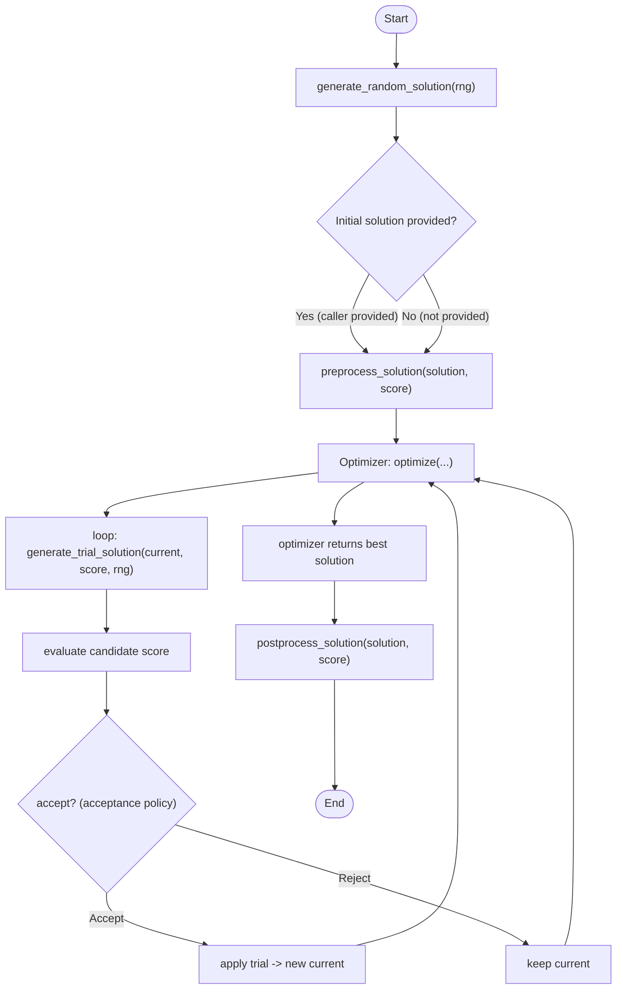

# Overview
- This document describes the public API design and intended usage of `OptModel` and `LocalSearchOptimizer` used throughout the repository.
- Primary source references: `src/model.rs`, `src/optim/base.rs`, `src/callback.rs`.

- Methods flow (Mermaid):

- Notes on the flow:
  - `generate_random_solution` is used when a caller does not provide an initial solution (helpers such as `LocalSearchOptimizer::run` call it). Implementations should produce a valid solution and its score.
  - `preprocess_solution` is executed before handing the solution to the optimizer (use for repairs, caching, or building auxiliary data structures).
  - Inside the optimizer, `generate_trial_solution` is called repeatedly to propose neighbors; it returns the candidate solution, a `TransitionType` describing the change (useful for Tabu or undo operations), and the candidate score.
  - Acceptance logic (which may use a `TransitionProbabilityFn` or other scheduler) decides whether to adopt the candidate.
  - After optimization completes, `postprocess_solution` is called to finalize or decode the result for the user.

## OptModel
- Purpose: defines the model interface that optimization algorithms operate on (solution generation, neighborhood/transitions and scoring).
- Trait path: `OptModel` (`src/model.rs`).
- Threading and object usage: trait is annotated with `#[auto_impl(&, Box, Rc, Arc)]` and requires `Sync + Send`. This makes it convenient to pass implementations as trait objects (`&dyn OptModel`, `Box<dyn OptModel>`, `Arc<dyn OptModel>`, etc.).
- Associated types:
  - `ScoreType`: ordering type for scores; bound `Ord + Copy + Sync + Send`.
  - `SolutionType`: concrete solution representation; bound `Clone + Sync + Send`.
  - `TransitionType`: describes a transition (move) between solutions; bound `Clone + Sync + Send`.
- Core required methods:
  - `generate_random_solution<R: rand::Rng>(&self, rng: &mut R) -> Result<(SolutionType, ScoreType), LocalsearchError>` — produce an initial random solution and its score. Returns `Result<..., LocalsearchError>` so implementations can report errors.
  - `generate_trial_solution<R: rand::Rng>(&self, current_solution: SolutionType, current_score: ScoreType, rng: &mut R) -> (SolutionType, TransitionType, ScoreType)` — given a current solution, generate a candidate trial solution, the transition describing the change, and the candidate score.
- Optional overrides with defaults:
  - `preprocess_solution(self, solution, score) -> Result<(SolutionType, ScoreType), LocalsearchError>` — default is identity; called before running the optimizer to allow model-level setup (e.g., repair, normalization, caching).
  - `postprocess_solution(self, solution, score) -> (SolutionType, ScoreType)` — default identity; called after optimization to finalize solution (e.g., decode internal format).

## LocalSearchOptimizer
- Purpose: abstract local-search optimization algorithms (simulated annealing, tabu, hill-climbing, etc.).
- Trait path: `LocalSearchOptimizer<M: OptModel>` (`src/optim/base.rs`).
- Also annotated with `#[auto_impl(&, Box, Rc, Arc)]` so optimizers can be used as trait objects.
- Key methods:
  - `optimize(&self, model: &M, initial_solution: M::SolutionType, initial_score: M::ScoreType, n_iter: usize, time_limit: Duration, callback: &mut dyn OptCallbackFn<M::SolutionType, M::ScoreType>) -> (M::SolutionType, M::ScoreType)` — the low-level entry point that runs `n_iter` iterations or until `time_limit` elapses. Implementations return the best-found solution and score.
  - `run(&self, model: &M, initial_solution_and_score: Option<(M::SolutionType, M::ScoreType)>, n_iter: usize, time_limit: Duration) -> Result<(M::SolutionType, M::ScoreType), LocalsearchError>` — convenience wrapper that will call `model.generate_random_solution` when an initial solution is not provided, apply `model.preprocess_solution`, then call `optimize`, and finally `model.postprocess_solution`. Returns `Result<..., LocalsearchError>`.
  - `run_with_callback(&self, model, initial_option, n_iter, time_limit, callback)` — same as `run` but accepts a callback to observe progress.
- Behavior and responsibilities:
  - Implementors of `optimize` should not call `generate_random_solution` — the `run`/`run_with_callback` helpers handle initial-solution generation and preprocessing.
  - `optimize` receives already-preprocessed initial solution and must return a final (possibly transformed) solution; `run` will call `postprocess_solution` after `optimize` returns.

## Callback and Progress
- Types: `OptProgress<S, SC>` and trait `OptCallbackFn<S, SC>` are defined in `src/callback.rs`.
- `OptProgress` fields: `iter: usize`, `acceptance_ratio: f64`, `solution: Rc<RefCell<S>>`, `score: SC` — the callback receives a reference-counted, mutable holder for the current best solution plus its score and iteration metadata.
- `OptCallbackFn` is `FnMut(OptProgress<S, SC>)` and intended for progress reporting (progress bars, logging, checkpointing). The callback receives periodic updates from implementations of `LocalSearchOptimizer`.

## Transition probability abstraction
- `TransitionProbabilityFn<ST>` is a trait alias for `Fn(ST, ST) -> f64` where `ST: Ord + Sync + Send + Copy` (`src/optim/base.rs`). Several optimizers accept a probability function determining acceptance of worse solutions.

## Design notes / best practices
- Keep `ScoreType` lightweight and `Copy` where possible to avoid unnecessary cloning.
- `SolutionType` is `Clone` because trial generation frequently requires passing ownership; implementers can wrap large structures in `Arc`/`Rc` if cloning cost is high.
- Use `TransitionType` to capture reversible moves (useful for Tabu lists, undoing moves, or efficient incremental scoring).
- Implement `preprocess_solution` to prepare inputs for the optimizer (e.g., build lookup tables) and `postprocess_solution` to convert internal representations back to user-facing solutions.
- Make callbacks lightweight and non-blocking; they run inside optimization loops and can impact performance.

## Example usage (outline)
- Implement `OptModel` for a problem type, providing `generate_random_solution` and `generate_trial_solution`.
- Choose an optimizer (e.g., `SimulatedAnnealingOptimizer`) and call `run` or `run_with_callback` to execute the search.

## References
- `src/model.rs` (OptModel definition)
- `src/optim/base.rs` (LocalSearchOptimizer + helpers)
- `src/callback.rs` (OptProgress and OptCallbackFn)

