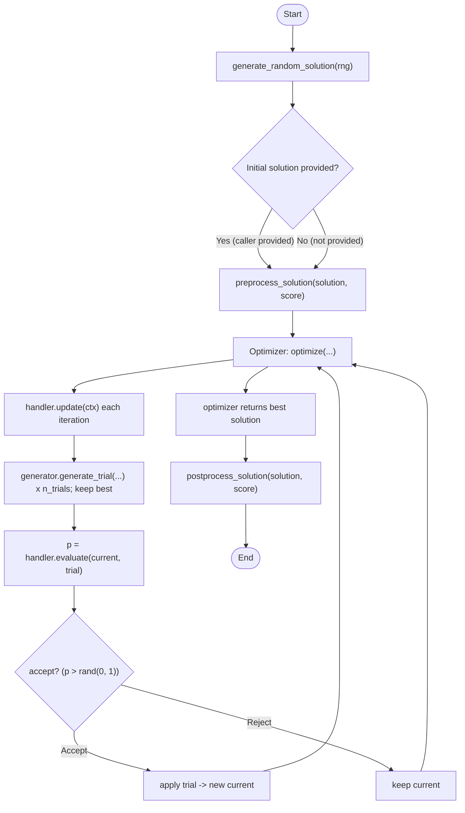

# API

- This document describes the public API design and intended usage of `OptModel` and `LocalSearchOptimizer` used throughout the repository.
- Primary source references: `src/model.rs`, `src/optim/base.rs`, `src/optim/transition.rs`, `src/optim/search_loop.rs`, `src/optim/generic.rs`, `src/optim/handlers.rs`, `src/callback.rs`.

Methods flow (Mermaid):

```mermaid
flowchart TD
    Start([Start]) --> GenRand["generate_random_solution(rng)"]
    GenRand --> HasInitial{"Initial solution provided?"}
    HasInitial -- "Yes (caller provided)" --> Pre["preprocess_solution(solution, score)"]
    HasInitial -- "No (not provided)" --> Pre
    Pre --> Optim["Optimizer: optimize(...)"]
    Optim --> Update["handler.update(ctx) each iteration"]
    Update --> LoopStart["generator.generate_trial(...) x n_trials; keep best"]
    LoopStart --> Eval["p = handler.evaluate(current, trial)"]
    Eval --> Decide{"accept? (p > rand(0, 1))"}
    Decide -- "Accept" --> Apply["apply trial -> new current"]
    Decide -- "Reject" --> Continue["keep current"]
    Apply --> Optim
    Continue --> Optim
    Optim --> Result["optimizer returns best solution"]
    Result --> Post["postprocess_solution(solution, score)"]
    Post --> End([End])
```

- Notes on the flow:
  - `generate_random_solution` is used when a caller does not provide an initial solution (helpers such as `LocalSearchOptimizer::run` call it). Implementations should produce a valid solution and its score.
  - `preprocess_solution` is executed before handing the solution to the optimizer (use for repairs, caching, or building auxiliary data structures).
  - Inside the optimizer, trial candidates come from a `TrialGenerator`. By default the loop drives `OptModel::generate_trial_solution` through `DefaultTrialGenerator`; the `n_trials` candidates per iteration are evaluated and the best-scoring one is kept. ALNS (and other adaptive schemes) plug in via `LocalSearchLoop::step_with_generator` or `GenericLocalSearchOptimizer::with_trial_generator` to drive trial generation through destroy/repair operators instead.
  - Acceptance is decided by a `TransitionHandler`: `handler.update` is invoked once per iteration before trials are generated (cooling schedules, water levels, etc.), then `handler.evaluate(current_score, trial_score)` returns the acceptance probability; the trial is accepted when `p > rand(0, 1)`. Improving transitions return `1.0` from the handler itself.
  - After optimization completes, `postprocess_solution` is called to finalize or decode the result for the user.

## OptModel
- Purpose: defines the model interface that optimization algorithms operate on (solution generation, neighborhood/transitions and scoring).
- Trait path: `OptModel` (`src/model.rs`).
- Threading and object usage: trait is annotated with `#[auto_impl(&, Box, Rc, Arc)]` and requires `Sync + Send`. This makes it convenient to pass implementations as trait objects (`&dyn OptModel`, `Box<dyn OptModel>`, `Arc<dyn OptModel>`, etc.).
- Associated types:
  - `ScoreType`: ordering type for scores; bound `Ord + Copy + Sync + Send`. Most concrete optimizers further require `ScoreType = NotNan<f64>` (see `ordered_float::NotNan`).
  - `SolutionType`: concrete solution representation; bound `Clone + Sync + Send`.
  - `TransitionType`: describes a transition (move) between solutions; bound `Clone + Sync + Send`.
- Core required methods:
  - `generate_random_solution<R: rand::Rng>(&self, rng: &mut R) -> Result<(SolutionType, ScoreType), LocalsearchError>` — produce an initial random solution and its score. Returns `Result<..., LocalsearchError>` so implementations can report errors.
  - `generate_trial_solution<R: rand::Rng>(&self, current_solution: SolutionType, current_score: ScoreType, rng: &mut R) -> (SolutionType, TransitionType, ScoreType)` — given a current solution, generate a candidate trial solution, the transition describing the change, and the candidate score.
- Optional overrides with defaults:
  - `preprocess_solution(&self, solution, score) -> Result<(SolutionType, ScoreType), LocalsearchError>` — default is identity; called before running the optimizer to allow model-level setup (e.g., repair, normalization, caching).
  - `postprocess_solution(&self, solution, score) -> (SolutionType, ScoreType)` — default identity; called after optimization to finalize solution (e.g., decode internal format).

## LocalSearchOptimizer
- Purpose: abstract local-search optimization algorithms (simulated annealing, tabu, hill-climbing, etc.).
- Trait path: `LocalSearchOptimizer<M: OptModel>` (`src/optim/base.rs`).
- Also annotated with `#[auto_impl(&, Box, Rc, Arc)]` so optimizers can be used as trait objects.
- Key methods:
  - `optimize(&self, model: &M, initial_solution: M::SolutionType, initial_score: M::ScoreType, n_iter: usize, time_limit: Duration, callback: &mut dyn OptCallbackFn<M::SolutionType, M::ScoreType>) -> (M::SolutionType, M::ScoreType)` — the low-level entry point that runs `n_iter` iterations or until `time_limit` elapses. Implementations return the best-found solution and score.
  - `run(&self, model: &M, initial_solution_and_score: Option<(M::SolutionType, M::ScoreType)>, n_iter: usize, time_limit: Duration) -> Result<(M::SolutionType, M::ScoreType), LocalsearchError>` — convenience wrapper that will call `model.generate_random_solution` when an initial solution is not provided, apply `model.preprocess_solution`, then call `optimize`, and finally `model.postprocess_solution`. Returns `Result<..., LocalsearchError>`.
  - `run_with_callback(&self, model, initial_option, n_iter, time_limit, callback)` — same as `run` but accepts a callback to observe progress.
- Behavior and responsibilities:
  - Implementors of `optimize` should not call `generate_random_solution` — the `run`/`run_with_callback` helpers handle initial-solution generation and preprocessing.
  - `optimize` receives already-preprocessed initial solution and must return a final (possibly transformed) solution; `run` will call `postprocess_solution` after `optimize` returns.
- Time types: `Duration` (and `Instant`) are re-exported from the crate root (`crate::time_wrapper`); on `wasm` targets they come from `web_time`, otherwise from `std::time`. Use the crate re-exports so code stays portable.

## Transition handlers

The acceptance/scheduling logic of each algorithm lives in a `TransitionHandler`, decoupled from the optimizer struct.

- Trait path: `TransitionHandler<ST>` (`src/optim/transition.rs`), with `ST: Ord + Send + Sync + Copy`. Requires `Send + Sync`.
- Methods:
  - `update(&mut self, ctx: &UpdateCtx<'_, ST>)` — called once per iteration before any trial is generated. Use to evolve internal state (cooling schedule, water level, offset, ...).
  - `evaluate(&self, current: ST, trial: ST) -> f64` — acceptance probability for the transition. Improving transitions (`trial < current`) must return `1.0`; values `>= 1.0` mean "always accept".
- `UpdateCtx<'a, ST>` fields: `iter: usize` (zero-based), `total: usize`, `acc: f64` (sliding-window acceptance ratio from the previous iteration), `best: &'a ST` (best score observed before the current iteration's trials).
- Provided handlers (re-exported from `src/optim/handlers.rs`, `src/optim/handlers/*`):
  - `Metropolis` — constant inverse temperature `beta`.
  - `SimulatedAnnealing` — geometric cooling of `beta` every `update_frequency` (non-zero) iterations.
  - `AdaptiveAnnealing` — adaptive temperature targeting an acceptance ratio (`AdaptiveScheduler`, `TargetAccScheduleMode`).
  - `RelativeAnnealing`, `LogisticAnnealing`, `GreatDeluge`, `EpsilonGreedy`, `TsallisAnnealing`.
  - Type aliases `MetropolisHandler`, `SimulatedAnnealingHandler`, `AdaptiveAnnealingHandler`, `EpsilonGreedyHandler`, `GreatDelugeHandler`, `LogisticAnnealingHandler`, `RelativeAnnealingHandler`, `TsallisHandler` point to the corresponding handler types.
- Tuning helpers:
  - `tune_temperature(model, initial_solution_and_score, n_warmup, target_prob) -> f64` — tunes inverse temperature from warmup trials (target acceptance probability for uphill moves).
  - `tune_cooling_rate(initial_beta, final_beta, n_iter) -> f64` — geometric cooling rate between two betas.
  - The `SimulatedAnnealing` handler exposes `tune_initial_temperature` and `tune_cooling_rate` builders that return the handler with `beta` tuned from warmup trials and `cooling_rate` computed to reach `1e2` after `n_iter` iterations. The `AdaptiveAnnealing` handler exposes `tune_initial_temperature` (target probability taken from `scheduler.initial_target_acc`). Useful when driving handlers through `GenericLocalSearchOptimizer`.
  - Concrete optimizers additionally expose `tune_initial_temperature` / `tune_cooling_rate` builder methods that delegate to the stored handler (require `ScoreType = NotNan<f64>`).

## Loop and generic optimizer

- `LocalSearchLoop<ST>` (`src/optim/search_loop.rs`) — the trial-and-accept loop shared by every local-search optimizer. Constructed with `LocalSearchLoop::new(patience, n_trials, return_iter)`:
  - `patience` — give up (early stop) if the score has not improved for this many iterations.
  - `n_trials` — number of trial candidates generated per iteration; the best is kept.
  - `return_iter` — return to the best solution after this many non-improving iterations.
- `LocalSearchLoop::step(model, initial_solution, initial_score, n_iter, time_limit, callback, handler) -> (StepResult<...>, H)` — runs up to `n_iter` iterations with the supplied handler and returns the `StepResult` plus the (possibly mutated) handler so per-run state survives the call. Trial generation goes through `DefaultTrialGenerator` (a thin wrapper over `OptModel::generate_trial_solution`). `LocalSearchLoop` itself stores no handler.
- `StepResult<S, ST>` fields: `best_solution`, `best_score`, `last_solution`, `last_score`, `acceptance_counter: AcceptanceCounter`.
- `GenericLocalSearchOptimizer<ST, H, G = DefaultTrialGenerator>` (`src/optim/generic.rs`) — owns a handler *blueprint* and an optional trial generator; each `optimize` call clones both, so the stored values stay untouched across runs and can be reused. Implements `LocalSearchOptimizer<M>` for any `M: OptModel` / `H: TransitionHandler<M::ScoreType> + Clone` / `G: TrialGenerator<M> + Clone`. Use it to drive an arbitrary handler through the standard optimizer interface; use `LocalSearchLoop` directly when you need the handler's or generator's post-run state.
- `AcceptanceCounter` (`src/counter.rs`, re-exported at crate root) — sliding-window acceptance counter (`new(window_size)`, `enqueue(accepted)`, `acceptance_ratio()`); window size 100 by default.

## Trial generators and ALNS

The trial-generation side of the search loop is pluggable through the `TrialGenerator` trait (`src/optim/search_loop.rs`). A generator produces one trial per `generate_trial` call and receives a `TrialOutcome` feedback once the loop knows what happened to that trial.

- `TrialOutcome` (`src/optim/search_loop.rs`) — classifies the trial as `NewBest`, `Improved`, `Accepted`, or `Rejected`. Adaptive generators (ALNS) use this to credit operator weights.
- `TrialGenerator<M: OptModel>` (`src/optim/search_loop.rs`) — `generate_trial(...)` and `feedback(outcome)`; object-safe so generators can be stored behind trait objects.
- `DefaultTrialGenerator` (`src/optim/search_loop.rs`) — the default generator; just calls `OptModel::generate_trial_solution` and ignores feedback.
- `LocalSearchLoop::step_with_generator(model, initial_solution, initial_score, n_iter, time_limit, callback, handler, generator) -> (StepResult<...>, H, G)` — same loop as `step`, but trial generation is driven by the supplied `generator`. The generator is returned alongside the result so its adapted state (e.g. ALNS weights) can be inspected.

ALNS is built on top of this trait:

- `DestroyOperator<M, P>` / `RepairOperator<M, P>` (`src/optim/alns.rs`) — traits the user implements to define destroy and repair operators. Operators must be `Send + Sync` and provide a `dyn_clone` method so the trait stays object-safe (a blanket `Clone` impl on `Box<dyn DestroyOperator<_, _>>` / `Box<dyn RepairOperator<_, _>>` delegates to `dyn_clone`).
- `Rewards` (`src/optim/alns.rs`) — per-outcome reward table (`new_best`, `improved`, `accepted`, `rejected`); defaults follow Ropke & Pisinger (33 / 9 / 13 / 0).
- `AlnsTrialGenerator<M, P>` (`src/optim/alns.rs`) — holds destroy and repair operator pools with independent roulette-wheel weights, segment-based weight updates, and a reaction-factor blending rule. Built with `AlnsTrialGenerator::new(destroy, repair)`; builder methods: `with_segment_size`, `with_reaction_factor`, `with_destroy_rewards`, `with_repair_rewards`, `with_rewards`. Inspected via `destroy_weights` / `repair_weights` / `destroy_usage` / `repair_usage` / `destroy_scores` / `repair_scores` / `trials_in_segment`.
- `GenericLocalSearchOptimizer::with_trial_generator(generator)` — swaps in an ALNS generator (or any other `TrialGenerator`) for the default one; returns a new optimizer with the new generator type.

See `src/tests/test_alns.rs` for a complete example.

## Concrete optimizers

All implement `LocalSearchOptimizer<M>` (most require `M::ScoreType = NotNan<f64>`):
`RandomSearchOptimizer`, `HillClimbingOptimizer`, `MetropolisOptimizer`, `SimulatedAnnealingOptimizer`, `LogisticAnnealingOptimizer`, `RelativeAnnealingOptimizer`, `AdaptiveAnnealingOptimizer`, `GreatDelugeOptimizer`, `EpsilonGreedyOptimizer`, `TsallisRelativeAnnealingOptimizer`, `TabuSearchOptimizer` (with `TabuList`), `ParallelTemperingOptimizer` (`with_geometric_betas`, `tune_temperature`), `PopulationAnnealingOptimizer` (`tune_initial_temperature`, `tune_cooling_rate`), plus `GenericLocalSearchOptimizer` for handler-driven runs.

Loop-based optimizers share the `patience` / `n_trials` / `return_iter` constructor parameters described above (algorithm-specific parameters follow them; e.g. `SimulatedAnnealingOptimizer::new(patience, n_trials, return_iter, initial_beta, cooling_rate, update_frequency)`).

Each optimizer instantiates its `TransitionHandler` in the constructor and stores it as a blueprint; `optimize` clones the blueprint and runs the per-iteration `update` mutations on the working copy, so the optimizer can be reused across runs. Handlers whose state is seeded from the run's initial score (`GreatDeluge` water level, `TsallisAnnealing` offset) reseed the working copy at the start of `optimize`.

## Callback and Progress
- Types: `OptProgress<S, SC>` and trait `OptCallbackFn<S, SC: PartialOrd>` are defined in `src/callback.rs` and re-exported from the crate root.
- `OptProgress` fields: `iter: usize`, `acceptance_ratio: f64`, `solution: Rc<RefCell<S>>`, `score: SC` — the callback receives a reference-counted, mutable holder for the current best solution plus its score and iteration metadata.
- `OptCallbackFn` is `FnMut(OptProgress<S, SC>)` and intended for progress reporting (progress bars, logging, checkpointing). The callback receives periodic updates from implementations of `LocalSearchOptimizer`.

## Design notes / best practices
- Keep `ScoreType` lightweight and `Copy` where possible; concrete annealing-family optimizers use `NotNan<f64>` (from `ordered_float`) as the score type.
- `SolutionType` is `Clone` because trial generation frequently requires passing ownership; implementers can wrap large structures in `Arc`/`Rc` if cloning cost is high.
- Use `TransitionType` to capture reversible moves (useful for Tabu lists, undoing moves, or efficient incremental scoring).
- Implement `preprocess_solution` to prepare inputs for the optimizer (e.g., build lookup tables) and `postprocess_solution` to convert internal representations back to user-facing solutions.
- Prefer implementing a new algorithm as a `TransitionHandler` and running it through `GenericLocalSearchOptimizer`; only implement `LocalSearchOptimizer` directly when the algorithm needs a different loop structure (e.g., Tabu, Parallel Tempering).
- Make callbacks lightweight and non-blocking; they run inside optimization loops and can impact performance.

## Example usage (outline)
- Implement `OptModel` for a problem type, providing `generate_random_solution` and `generate_trial_solution`.
- Choose an optimizer (e.g., `SimulatedAnnealingOptimizer`) and call `run` or `run_with_callback` to execute the search.
- To use a custom acceptance policy, implement `TransitionHandler<ScoreType>` and wrap it in `GenericLocalSearchOptimizer::new(patience, n_trials, return_iter, handler)`.

## References
- `src/model.rs` (OptModel definition)
- `src/optim/base.rs` (LocalSearchOptimizer + run/run_with_callback)
- `src/optim/transition.rs` (TransitionHandler + UpdateCtx)
- `src/optim/search_loop.rs` (LocalSearchLoop, StepResult, TrialGenerator, TrialOutcome, DefaultTrialGenerator)
- `src/optim/generic.rs` (GenericLocalSearchOptimizer)
- `src/optim/handlers.rs` (per-algorithm handlers and tuning helpers)
- `src/optim/alns.rs` (AlnsTrialGenerator, DestroyOperator, RepairOperator, Rewards)
- `src/callback.rs` (OptProgress and OptCallbackFn)
- `src/counter.rs` (AcceptanceCounter)
- `src/time_wrapper.rs` (Duration / Instant re-exports)
